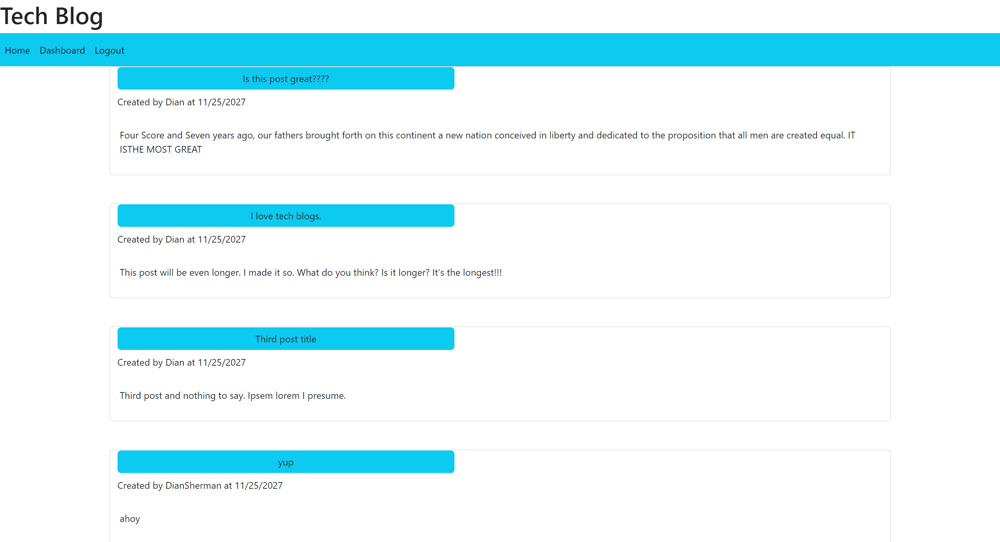

# MVC-Tech-Blog

## Description
A tech blog. You can sign in, sign up, comment, and create posts! 
      
## Table of Contents
* [Installation](#installation)
* [Usage](#usage)
* [Screenshot](#screenshot)
* [Credits](#credits)
* [License](#license)
* [Contributing](#contributing)
* [Questions](#questions)
      
## Installation
Once we have our Github, terminal, and vscode ready to go, we need to:
npm i
npm run seed
node server.js
      
## Usage
Login in or sign up to be able to post.  You can add comments from the home page or create, update, and delete comments in your dashboard.
      
## Screenshot:

 The following video demonstrates the application functionality:

 

## Credits
The TAs at bootcamp.  Joe Rehfuss for teaching us. W3Schools, Mozilla, and StackOverflow.

## License
This application is covered under . See repo for license.
      
## Contributing
You needn't contribute, but if you'd like to, please follow the rules in the repo.
  
## Questions
[Link to diangigrich's GitHub](https://github.com/diangigrich)

[Contact Us](mailto:slayer_barrett_@hotmail.com)